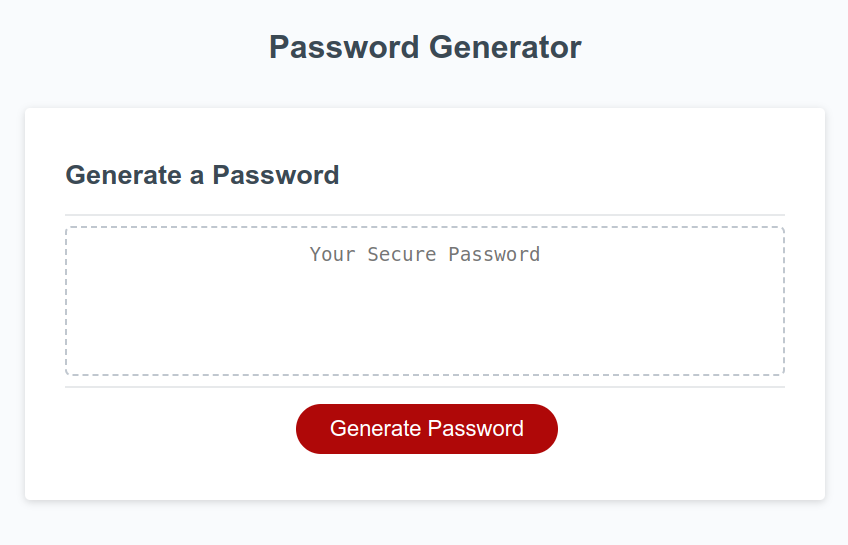
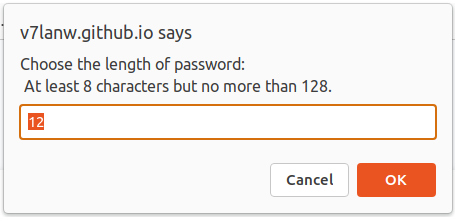
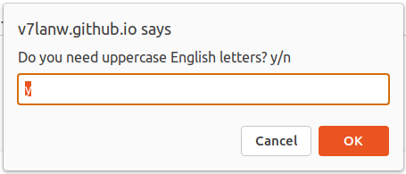
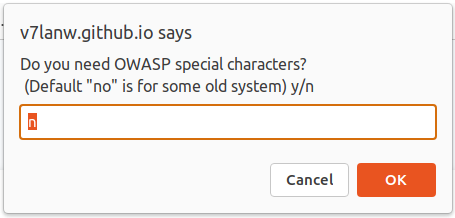
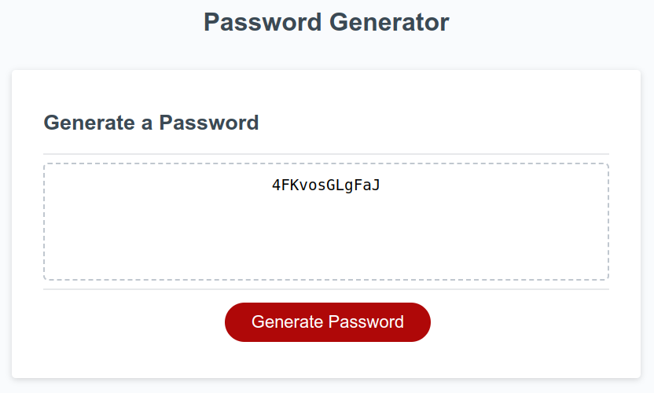
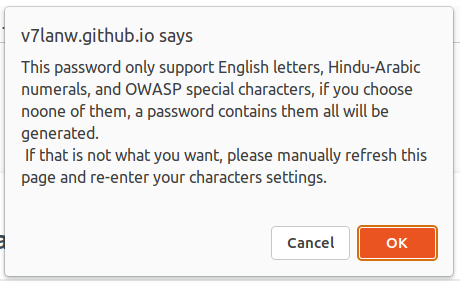
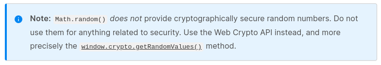
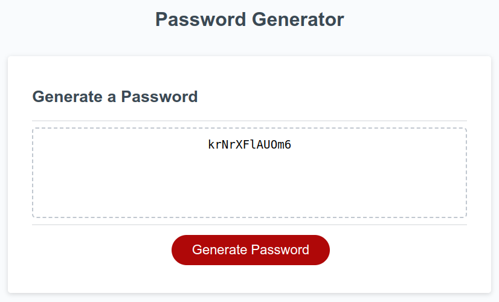
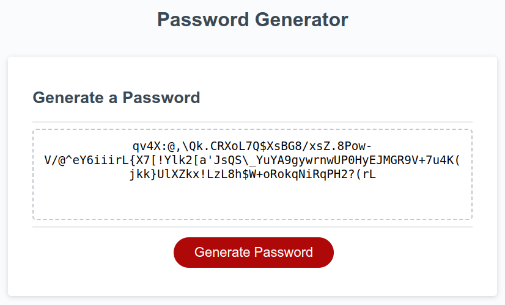
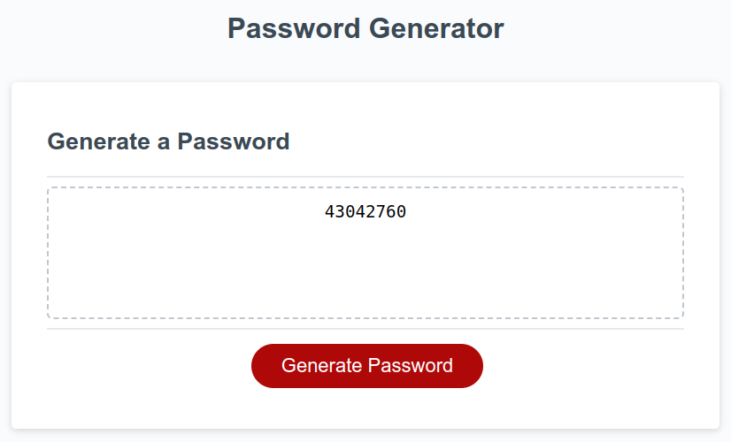

# js-pswd-gen

JavaScript Password Generator

## Deployment

<https://v7lanw.github.io/js-pswd-gen/>

## Usage

Generally, it could generate pure letters passwords, pure digits passwords, pure special characters passwords, and mixed characters passwords.

+ Step 1:
  visit the [GitHub page](https://v7lanw.github.io/js-pswd-gen/), click `Generate Pasword` button.
  

+ Step 2:
  Choose your password length.
  

+ Step 3:
  Choose characters setting by answering four Yes/No questions
  + 3.1:
    Choose lowercased English letters
    
  + 3.2:
    Choose uppercased English letters
    
  + 3.3:
    Choose 0~9 digits
    
  + 3.4:
    Choose special characters
    

+ Step 4:
  It will generate a password string for you, like:
  

## Features

1. Checking user inputs
   + The password generator will check the length number of user input, and modify it into the range (8 chars to 128 chars).
   + The Yes/No questions are allowed fuzzy inputs.
   + At least a kind of characters, or the password generator will warn users and choose all the character settings like:
   

2. Default values
   + default password length is 12
   + default character settings are both lower and upper cased letters with digits, and without special characters. (These settings are still used in some old systems).

3. More secure JavaScript random function
   Normally, we will use `Math.random()` function to generate random numbers, but this function does not provide cryptographically security.

   In MDN web docs, they advise to use `window.crypto.getRandomValues()` function.
   

## Brief logic

1. The entry is `generatePassword()`, it calls `getPasswordOptions()` to get password setting, then parse the setting and prepare for candidate characters array. The array will be used in a for loop with `getRandom()` function to generate one character of password per loop. With the password length number of loop cycles, a password string will be generated.
2. Password option structure

   > ``` JavaScript
   > // Explanation by example, a password option looks like:
   > //    "|1 0 0 0 0 0 0 0|1|1|1|0|"
   > //    "|_ _ _ _ 1 0 0 0|1|0|1|1|"
   > //     |_ _ _ _ _ _ _ _|_|_|_|_| LSB
   > // MSB 1110 9 8 7 6 5 4 3 2 1 0  LSB
   > //    bit 0: OWASP special characters option, 1 for chosen, 0 for not chosen.
   > //    bit 1: Hindu-Arabic numerals option, 1 for chosen, 0 for not chosen.
   > //    bit 2: uppercase English letters, 1 for chosen, 0 for not chosen.
   > //    bit 3: lowercase English letters, 1 for chosen, 0 for not chosen.
   > // bit 4~11: password length in binary format.
   > ```

   It is the return value of `getPasswordOptions()`, and it will be parsed bit by bit in `generatePassword()`.
3. `getRandom()` function uses candidate characters array as input, then uses `window.crypto.getRandomValues()` to generate a more secure random number in the range of 0 to the length of input array, and this number indecates to a character in password. Therefore, `getRandom()` needs to be executed multiple times to get the password string.
4. User input checking functions are used in `getPasswordOptions()`, and other functions are used for page display. 

## Results

+ default setting result (12-char long, lowercase, uppercase and digits)


+ ultimate result (128-char long, lowercase, uppercase, digits and special letters)


+ pure digits result which like the form of 2FA or MFA (8-char long and digits, you could regard it as two 4-digit 2FA codes, or one 6-digit 2FA code with 2 extra digits). (It is just a toy, don't use this in a real 2FA or MFA application!!!)


+ You could try it and generate other passwords. Again, this is just a toy project, it may not be the perfect tool as a password generator, but it must be a good tool as a random characters string generator.

## Reference

[Math.random()](https://developer.mozilla.org/en-US/docs/Web/JavaScript/Reference/Global_Objects/Math/random)

[Crypto.getRandomValues()](https://developer.mozilla.org/en-US/docs/Web/API/Crypto/getRandomValues)

[There’s Math.random(), and then there’s Math.random()](https://v8.dev/blog/math-random)
